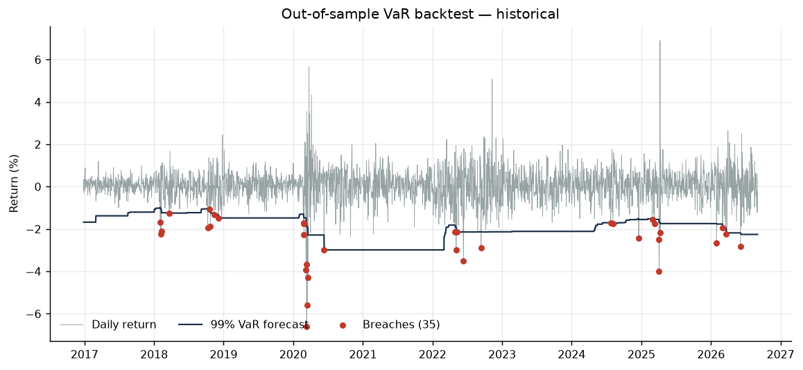

# Portfolio Risk Analytics Engine

Value-at-Risk and Expected Shortfall estimation for a multi-asset portfolio, with
out-of-sample backtesting to test whether the risk models actually hold up.

Computing a VaR number is straightforward. Establishing whether the model was
right is the harder problem, and it is the one this project is built around.

Data: SPY, QQQ, EFA, TLT, GLD — equal weighted, 2,933 trading days from January
2015 to September 2026.

---

## The finding

Three VaR models were estimated on a rolling 500-day window and tested out of
sample against 2,433 subsequent trading days at 99% confidence. A correct model
should breach on about 1% of days — roughly 24 times.

| Model | Breaches | Expected | Rate | Kupiec p | Christoffersen p | Verdict |
|---|---|---|---|---|---|---|
| Historical simulation | 35 | 24.3 | 1.44% | 0.041 | 0.001 | rejected |
| Parametric (normal) | 53 | 24.3 | 2.18% | <0.001 | 0.033 | rejected |
| Parametric (Student-t) | 35 | 24.3 | 1.44% | 0.041 | 0.014 | rejected |

**All three fail.** That is the result, and it is more informative than a clean
pass would have been.

The parametric normal model fails worst and fails obviously. It breached 53
times against 24.3 expected — more than double the promised rate, with a Kupiec
p-value indistinguishable from zero. The cause is visible in the return
distribution: excess kurtosis of 9.94, and a Jarque-Bera statistic of 12,038
that rejects normality outright. A normal distribution cannot price a tail it
does not believe exists.

Fixing the distribution helps, but not enough. Refitting with a Student-t cuts
breaches from 53 to 35 and brings the rate from 2.18% down to 1.44%. Historical
simulation, which assumes no distribution at all, lands in exactly the same
place. Both are still rejected at the 5% level.

**The deeper problem is in the Christoffersen column.** Every model fails the
independence test, historical simulation most severely at p = 0.001. The
breaches are not spread evenly through time — they arrive in clusters. The
models are not merely somewhat wrong on average; they are wrong in
concentrated bursts, which is to say they fail precisely when they are needed.

This is what fixing the distribution cannot address. All three estimators are
unconditional: they treat the last 500 days as one homogeneous sample and
produce a forecast that barely moves from day to day. Realized volatility does
not behave that way. It clusters, so a static forecast is simultaneously too
high in calm markets and far too low entering a stressed one.

The implication is that the next thing worth building is not a better
distributional assumption but a conditional volatility model. GARCH(1,1) or an
EWMA-driven VaR would let the forecast respond to the current regime rather
than to a trailing average of the last two years. That is the top item under
limitations below, and this backtest is the evidence for why it matters.



---

## Two other results worth stating

**Equal weight is not equal risk.** The portfolio holds five assets at 20% each.
Decomposed by contribution to portfolio volatility:

| Asset | Weight | Risk contribution |
|---|---|---|
| QQQ | 20% | 32.3% |
| SPY | 20% | 26.0% |
| EFA | 20% | 24.7% |
| GLD | 20% | 12.3% |
| TLT | 20% | 4.7% |

Long-duration Treasuries carry a fifth of the capital and under 5% of the risk.
Two thirds of portfolio volatility comes from the three equity sleeves. A
portfolio that looks diversified on a pie chart is, in risk terms, an equity
position with some ballast.

**Diversification decays under stress.** Average pairwise correlation runs 0.244
in calm regimes and 0.363 on days when the portfolio sits more than 10% below
its running peak — an increase of 0.119. The hedge weakens as it becomes
useful.

The deepest drawdown in the sample was 25.5%, peaking December 2021, troughing
October 2022, and taking 496 days to recover. That episode is precisely one in
which equities and long bonds fell together, which is the correlation result
above expressed as a loss.

---

## What it does

**Four VaR estimators, because they disagree and the disagreement is informative**

- Historical simulation — no distributional assumption, but cannot forecast a
  loss worse than the worst already observed
- Parametric normal — closed form, fast, and wrong in the tail
- Parametric Student-t — fitted degrees of freedom, admits kurtosis
- Monte Carlo — Cholesky-factorized covariance preserving correlation
  structure, with selectable normal or t innovations

**Expected Shortfall** alongside every VaR figure. VaR states the threshold; ES
states the average loss once the threshold is crossed. The ES/VaR ratio is a
direct read on tail thickness — 1.15 under the normal model against 1.47
empirically. On $1m of notional at 99% one day, the normal model reports
$19,297 of expected tail loss where the empirical distribution shows $28,624.
The model understates the tail by roughly a third.

**Model validation**

- Kupiec (1995) unconditional coverage — did the model breach at the promised
  rate?
- Christoffersen (1998) independence — were breaches spread out or clustered?
  Clustered breaches mean the model fails precisely when it is needed, which is
  the worse defect and the one that shows up here.

**Portfolio diagnostics**

- Risk contribution decomposition
- Drawdown path, depth, duration, and recovery
- Realized and EWMA (λ=0.94, RiskMetrics) volatility
- Correlation by regime

---

## A note on the correlation analysis

The standard way to show that correlations rise in a crisis is to take the worst
decile of days and correlate them. That approach is biased.

Boyer, Gibson and Loretan (1999) showed that conditioning on one tail of a
common factor truncates that factor's variance within the subsample, which
mechanically depresses measured correlation even when the true correlation is
unchanged. A naive implementation can report correlations *falling* during a
selloff, which is an artifact rather than a finding.

This implementation defines the stress regime by drawdown state — days where the
portfolio sits more than 10% below its running peak — which is a persistent
condition rather than a selection on the same returns being correlated.

---

## Running it

```bash
git clone https://github.com/<your-username>/portfolio-risk-engine.git
cd portfolio-risk-engine
pip install -r requirements.txt
python run_analysis.py
```

Options:

```bash
python run_analysis.py --tickers SPY QQQ TLT GLD EFA --start 2010-01-01
python run_analysis.py --confidence 0.95 --value 5000000
python run_analysis.py --weighting inverse-vol --window 750
```

Prices are pulled from Yahoo Finance via `yfinance` and cached to `data/`. If
the network is unavailable, a synthetic generator produces correlated
Student-t returns so the pipeline remains runnable and testable offline.

Tests:

```bash
pytest tests/ -v
```

Twenty tests, including closed-form checks — parametric VaR is verified against
the analytical normal quantile, Monte Carlo is verified to converge to the
parametric result under normal draws, and the backtest is verified to be
genuinely out of sample by confirming that perturbing the final observation
leaves earlier forecasts unchanged.

---

## Structure

```
riskengine/
  data.py         price loading, caching, synthetic fallback
  portfolio.py    weighting schemes, risk contribution
  var.py          VaR and ES estimators
  backtest.py     Kupiec and Christoffersen tests
  analytics.py    drawdown, volatility, regime correlation
  plots.py        figures
run_analysis.py   CLI
tests/            test suite
```

---

## Known limitations

Stated plainly, because a risk model whose assumptions are not written down is
not a risk model.

- **No conditional volatility model.** This is the binding limitation, and the
  backtest above is the evidence. All three estimators are unconditional, and
  all three fail the independence test. GARCH(1,1) or EWMA-driven VaR is the
  natural next build.
- **Square-root-of-time scaling** for multi-day horizons assumes i.i.d.
  returns. Volatility clusters, so this understates risk at longer horizons —
  the same defect as above in a different place.
- **Static weights.** Daily rebalancing is assumed and transaction costs are
  ignored.
- **ETFs only.** No options, so no delta-gamma approximation and no jump risk
  beyond what the underlying already shows.
- **The sample contains one major stress episode.** Conclusions about tail
  behaviour rest largely on 2020 and 2022.

---

## References

Kupiec, P. (1995). Techniques for verifying the accuracy of risk measurement
models. *Journal of Derivatives*.

Christoffersen, P. (1998). Evaluating interval forecasts. *International
Economic Review*.

Boyer, B., Gibson, M., and Loretan, M. (1999). Pitfalls in tests for changes in
correlations. *Federal Reserve International Finance Discussion Paper*.
